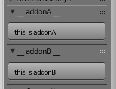

# blender_addon_wrapper
Allows to put multiple python files and addons in one folder. 

The `__init__.py` file will automatically load all sibling/child python files and call their register functions. It will also seek and register all classes that can be registered by Blender.

Python files registered with this class will also be reloaded when pressing `F8` in Blender.

Handy for rapid development.

Works Blender 2.73 and 2.82

This project contains no License: https://choosealicense.com/no-permission/

## Install example
Linux:
```bash
cd $HOME/.config/blender/2.73/scripts/addons
git clone https://github.com/EmileSonneveld/blender_addon_wrapper.git
```
Windows:
```cmd
cd %appdata%\Blender Foundation\Blender\2.73\scripts\addons
git clone https://github.com/EmileSonneveld/blender_addon_wrapper.git
```

- Open Blender
- Pres Ctrl-Alt-U
- Enable the addon

- The following 2 panels should become visible:

